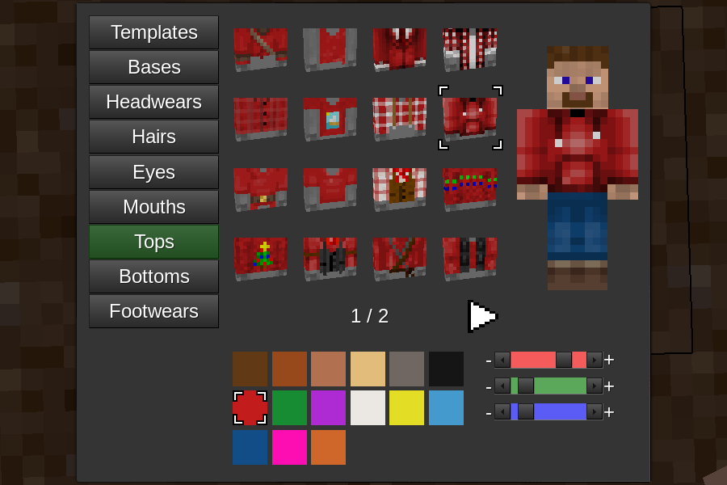

# Edit Skin Mod

This mod allows advanced skin customization.
New players get a randomly selected male or female skin.
It is compatible with sfinv, sfinv_buttons, i3, unified_inventory, inventory_plus, smart_inventory, and 3d_armor.
Use the /skin command to open the skin configuration screen.
This mod requires Minetest 5.5+
This mod was originally made for MineClone 5.

## License
Code under MIT license
Author: MrRar

See image_credits.txt for image licensing.

## API

### `edit_skin.register_item(item)`
Register a skin item. `item` is a table with item properties listed below.

### Item properties
`type`
Set the item type. Valid values are: "base", "footwear", "eye", "mouth", "bottom", "top", "hair", "headwear"

`texture`
Set to the image file that will be used. If this property is omitted "blank.png" is used.

`mask`
Set the color mask texture. Coloring is only applied to non transparent areas of the texture.
Coloring only works for "base", "bottom, "top", and "hair".

`preview_rotation`
A table containing properties x and y. x and y represent the x and y rotation of the item preview.

`alex`
If set to true the item will be default for female character.

`steve`
If set to true the item will be default for male character.

### `edit_skin.show_formspec(player, active_tab, page_num)`
Show the skin configuration screen.
`player` is a player ObjectRef.
`active_tab` is the tab that will be displayed. This parameter is optional.
Can be one of: "base", "footwear", "eye", "mouth", "bottom", "top", "hair", "headwear"

`page_num` The page number to display of there are multiple pages of items.
This parameter is optional. Must be a number. If it is not a valid page number the closest page number will be shown.

### `edit_skin.register_on_set_skin(func)`
Register a function to be called whenever a player skin changes.
The function will be given a player ObjectRef as a parameter.

### `edit_skin.make_hand_texture(base, colorspec)`
Generate a texture string from a base texture and color.
This function is used by mods that want to have a first person hand textured like the player skin.

### `edit_skin.save(player)`
Save player skin. `player` is a player ObjectRef.

### `edit_skin.update_player_skin(player)`
Update a player based on skin data in edit_skin.players.
`player` is a player ObjectRef.

### `edit_skin.base_color`
A table of ColorSpec integers that the player can select to color the base item.
These colors are separate from `edit_skin.color` because some mods register two nodes per base color so the amount of base colors needs to be limited.

### `edit_skin.color`
A table of ColorSpec integers that the player can select to color colorable skin items.

### `edit_skin.players`
A table mapped by player name containing tables holding the player's selected skin items and colors.
Only stores skin information for logged in users.

### edit_skin.compile_skin(skin)
`skin` is a table with skin item properties.
Returns an image string.
