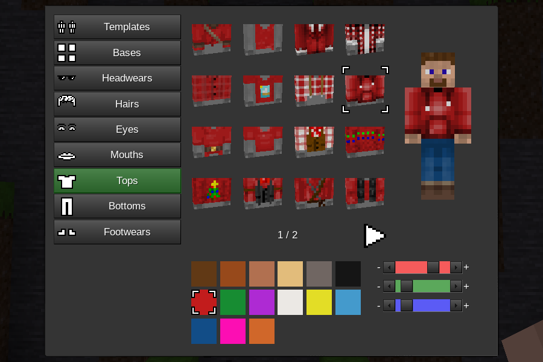

# Edit Skin Mod

This mod allows advanced skin customization.
New players get a randomly selected male or female skin.
It is compatible with sfinv, sfinv_buttons, i3, unified_inventory, inventory_plus, smart_inventory, and 3d_armor.
Use the /skin command to open the skin configuration screen.
This mod requires Minetest 5.5+
This mod was originally made for MineClone 5.

## License
Code under MIT license

Author: MrRar

See media_credits.txt for media licensing.

## API

### `edit_skin.register_item(item)`
Register a skin item. `item` is a table with item properties listed below.

### Item properties
`type`
Set the item type. Valid values are: "base", "footwear", "eye", "mouth", "bottom", "top", "hair", "headwear"

`texture`
Set to the image file that will be used. Transparent or semitransparnt parts of the texture can be colored by the `mask` texture. If this property is omitted "blank.png" is used.

`mask`
Set the color mask texture. Coloring is only applied to non transparent areas of the texture.
Coloring only works for "base", "bottom, "top", and "hair".

`preview_rotation`
A table containing properties `x` and `y`. `x` and `y` represent the x and y rotation of the item preview.

`alex`
If set to true the item will be default for female character.

`steve`
If set to true the item will be default for male character.

`restricted_to_admin`
This item can only be selected by players with `edit_skin_admin` privilege.

`for_player`
This property is used to restrict the item to a specific player or players. If set to a string, the string is a player name. If set to a table, the table is an array of player names.

`rank`
This property is used to change the application order of the skin item when applied to a player.
The default ranks for each item type are:

base: 10

footwear: 20

eye: 30

mouth: 40

bottom: 50

top: 60

hair: 70

headwear: 80

Lower ranks are applied to the player first and can thus be covered by higher rank items.

### `edit_skin.show_formspec(player)`
Show the skin configuration screen.
`player` is a player ObjectRef.

### `edit_skin.register_on_set_skin(func)`
Register a function to be called whenever a player skin changes.
The function will be given a player ObjectRef as a parameter.

### `edit_skin.save(player)`
Save player skin. `player` is a player ObjectRef.

### `edit_skin.update_player_skin(player)`
Update a player based on skin data in edit_skin.players.
`player` is a player ObjectRef.

### `edit_skin.base_color`
A table of ColorSpec integers that the player can select to color the base item.
These colors are separate from `edit_skin.color` because this mod registers a mesh hand node for each base and base color combination. The number of junk mesh hand nodes should be kept to a minimum.

### `edit_skin.color`
A table of ColorSpec integers that the player can select to color colorable skin items.

### `edit_skin.players`
A table mapped by player ObjectRef containing tables holding the player's selected skin items and colors.
Only stores skin information for logged in players.

### `edit_skin.player_formspecs`
A table mapped by player ObjectRef containing tables holding player formspec state. The tables have the following properties:

`active_tab`
Set to the name of the current active tab.

`page_num`
Set to the current formspec page number.

### `edit_skin.compile_skin(skin)`
`skin` is a table with skin item properties.
Returns an image string.
